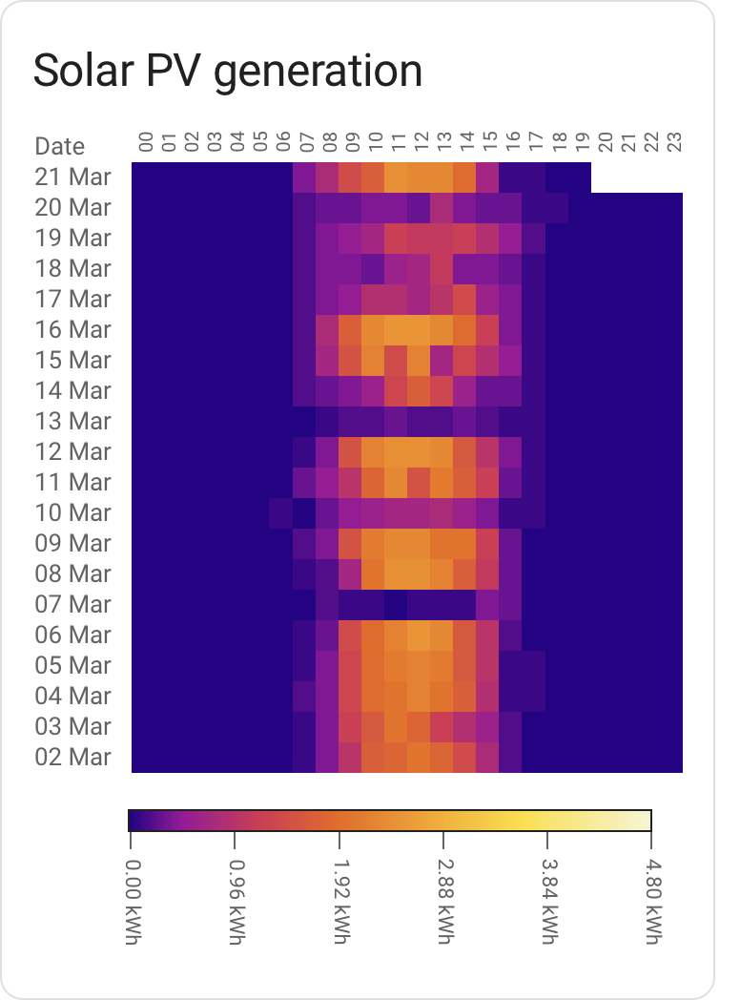

# Heatmap card for Home Assistant


Custom card enabling [Heat maps](https://en.wikipedia.org/wiki/Heat_map) in Home Assistant.

Will pick a hopefully useful color scale out of the box based on your type of data ([Device Class](https://www.home-assistant.io/integrations/sensor/#device-class)), but you can override most aspects of the card to suit your needs.

## What is this useful for?
Quickly spotting patterns in data. On your left is the last few weeks worth of my solar energy generation; darker colors means less energy generated, brighter colors more energy.

You can quickly see that the cloud cover hasn't been favourable the last week or so. It's also evident that the days overall getting longer.

There are certainly other ways to visualise the same data, but few that offer quite as much information at a glance.

<br clear="both"/>

## Installation
This module is not yet available in HACS or widely advertised; if you're reading this, chances are that I told you about it directly.

For now, you need to install it manually:

  * Download `heatmap-card.js`, place it in your `config/www` directory.
  * Add `/local/heatmap-card.js` in your Resource config, type of `JavaScript Module`.

<br clear="both"/>

## Configuration
### Minimal example


Given a minimal config, the card will try to figure out how to present data in a somewhat sane way:

```
type: custom:heatmap-card
entity: sensor.aranet_uppe_temperature
```

It'll pick a card `title` based on the name of the entity, present 21 days worth of data and pick a color scheme and scale based on the entity [device type](https://www.home-assistant.io/integrations/sensor/).

It's a bit opinionated in what a "good" scale will be, and _may_ give you something that's not really fit for your usage (for instance by assuming that temperature sensor data refers to _indoor_ temperature).

That said, for a lot of data types, it should give you something workable out of the box.

<br clear="both"/>

### Energy configuration example


A slightly more involved example, setting the number of days to present as well as
defining the `max_value`. Setting a max value is important in order to make the display
consistent across different time periods; ensuring that the same color shade always means the same consumption.

In the case of energy type entities, setting `max_value` to f.x the total production
capacity in kW of a PV install or the main fuse capacity of your house would make
sense.

```
title: Grid energy usage
type: custom:heatmap-card
entity: sensor.elforbrukning_lb
max_value: 14
days: 20
```

Some common fuse sizes and the corresponding maximum power draw:

|Fuse size| kW / max_value|
|     ---:|          ---: |
|      16A|             11|
|      20A|             14|
|      25A|             17|
|      35A|             24|

<br clear="both"/>
