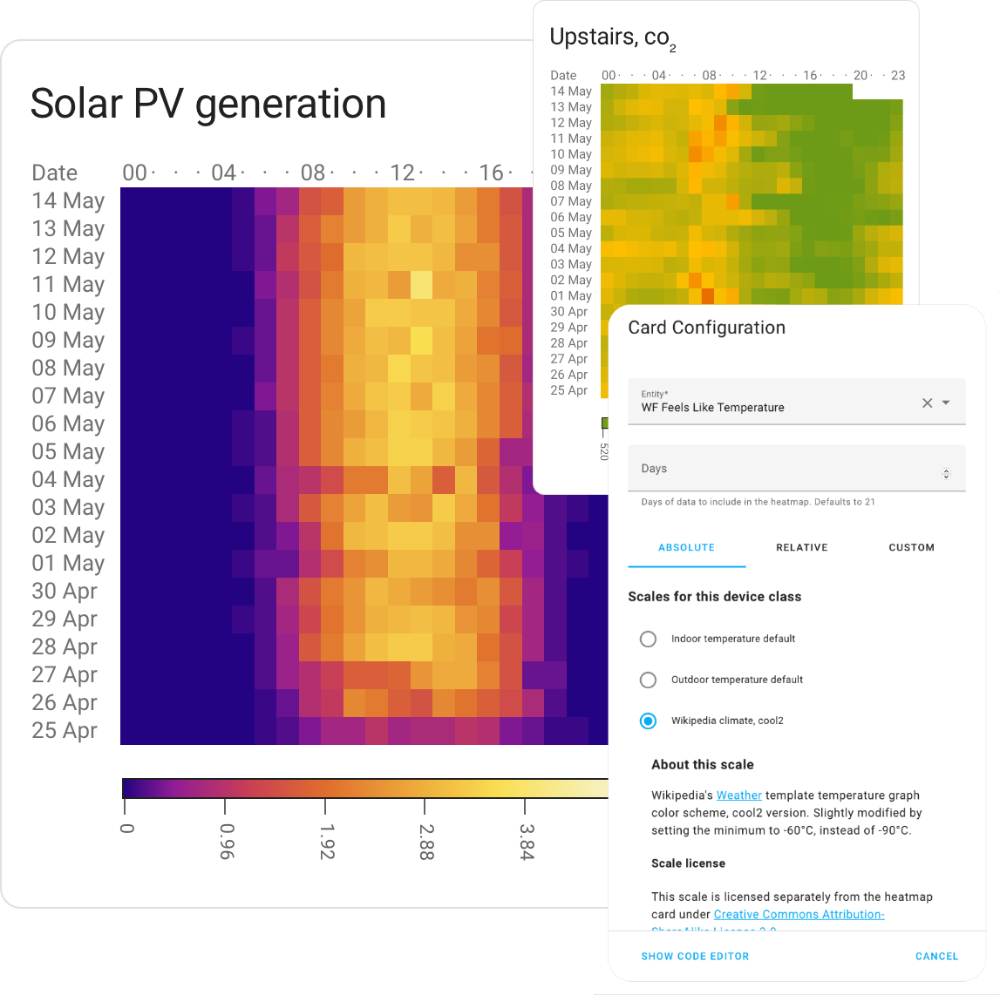
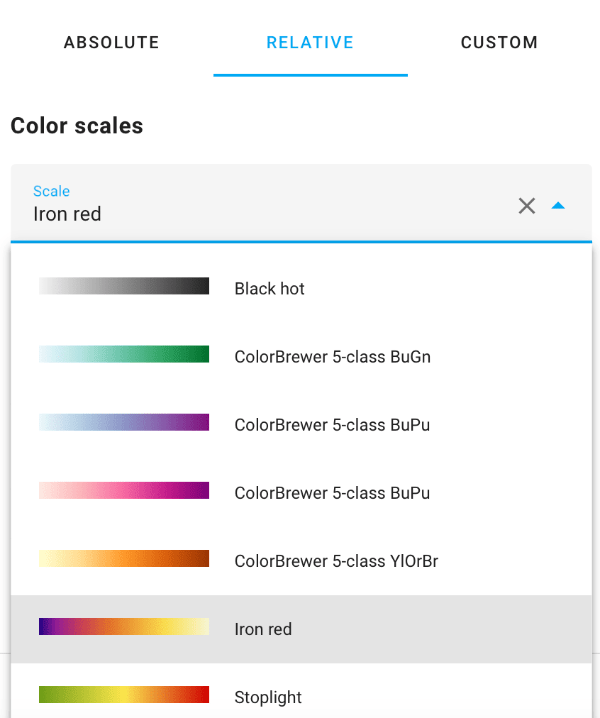
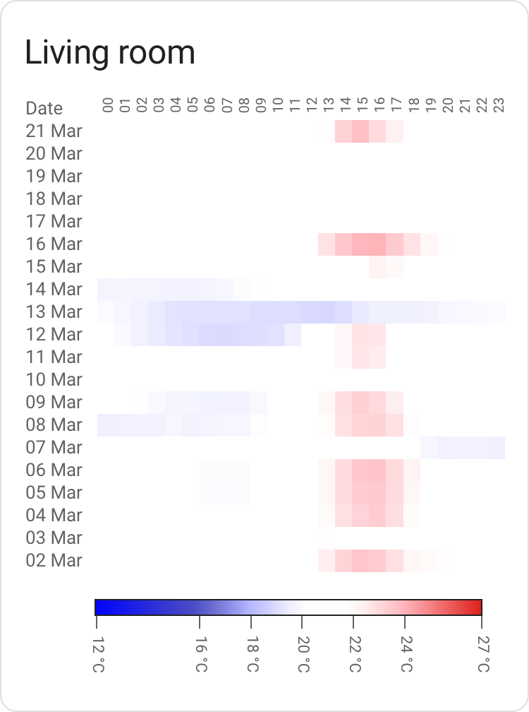
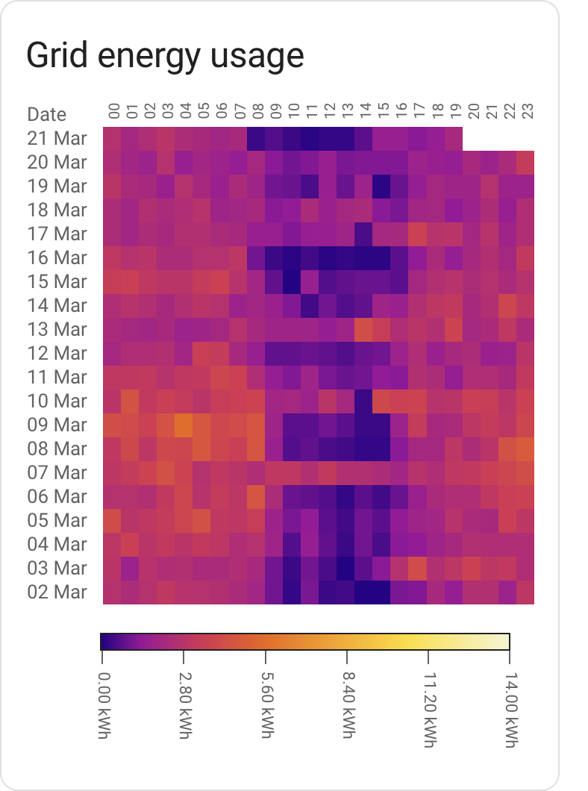

# Heatmap card for Home Assistant
<p align="center">
  
</p>

Custom card enabling [Heat maps](https://en.wikipedia.org/wiki/Heat_map) in Home Assistant. Makes it simple to visualize the data in your Home Assistant, as a heatmap, in a way that (hopefully) makes sense to you.

Will pick a hopefully useful scale out of the box based on your type of data ([Device Class](https://www.home-assistant.io/integrations/sensor/#device-class)), but you can override most aspects of the card to suit your needs.

## Current state?
* Somewhat real world tested, but there might well be corner cases.
* Still need a decent chunk of work in terms of built-in color scales for various sensor types. Expect the scales to change.
* Bit of polish still needed in some spots.

## Installation
### HACS
[](https://my.home-assistant.io/redirect/hacs_repository/?owner=kandsten&repository=ha-heatmap-card&category=Lovelace)

If you use [HACS](https://hacs.xyz) as-is, this card can be added as a **custom repository**.

(As always, you should be careful with software which lets you pull random code from the Internet and run it)

### Manual install
  * Download `heatmap-card.js`, place it in your `config/www` directory.
  * Add `/local/heatmap-card.js` in your Resource config, type of `JavaScript Module`.

## Configuration using the GUI
Most of the functionality of this card can be configured via the editor GUI.

You pick between `absolute` scales and `relative` scales.

_Absolute scales_ cover things like PM<sub>2.5</sub> particle counts, VOC, CO<sup>2</sup> and temperature. For these scales, there's typically one or more authorities that define what's a good value and a bad value. For instance, for PM<sub>2.5</sub>, WHO is one such authority.

Absolute scales don't require any additional configuration, but they don't support all types of sensors.

_Relative scales_ cover any data. You pick a color you fancy and optionally tell the card the min and max values of the data.

While setting min/max _is_ optional, it's encouraged to do so where possible, as the colors will be stable; a particular shade of green will always mean the same thing. Without setting min and max, it'll fluctuate depending on the data.

<p align="center">
  
</p>

_High resolution_

Loads 5 minutes data, but this data is usually purged after 10 days. Check `recorder.purge_keep_days` for more information.

_Smooth low-precision data_ *

If for example your kWh energy sensor is 2 digit precision only but the average energy consumption per interval (hour or 5 minutes) is much lower, then you can use this flag to average the value (e.g. 0.01 kWh) over the previous plateau with zero values.

<sup>* `total` and `total_increasing` sensors only</sup>


## Configuration using YAML
### Minimal example


Given a minimal config, the card will try to figure out how to present data in a somewhat sane way:

```
type: custom:heatmap-card
entity: sensor.aranet_uppe_temperature
```

It'll pick a card `title` based on the name of the entity, present the default 21 days worth of
data and pick a color scheme and scale based on the entity [device type](https://www.home-assistant.io/integrations/sensor/).

It's a bit opinionated in what a "good" scale will be, and _may_ give you something that's not really
fit for your usage (for instance by assuming that temperature sensor data refers to _indoor_ temperature).

This can be solved by picking a scale explicitly instead.

<br clear="both"/>

### Energy configuration example


A slightly more involved example, setting the number of days to present as well as
defining the `max` value. Setting a max value is important in order to make the display
consistent across different time periods; ensuring that the same shade of color always
translates to the same consumption.

In the case of energy type entities, setting `max` to f.x the total production
capacity in kW of a PV install or the main fuse capacity of your house would make
sense.

```
title: Grid energy usage
type: custom:heatmap-card
entity: sensor.elforbrukning_lb
data:
  min: 0
  max: 14
days: 20
```

Some common fuse sizes and the corresponding maximum power draw:

|Fuse size| kW / data.max |
|     ---:|          ---: |
|      16A|             11|
|      20A|             14|
|      25A|             17|
|      35A|             24|

<br clear="both"/>


### Custom color scales
Don't fancy the out of the box color scales? Bring your own!

A color scale contains _steps_. Each `step` has a `value` and
a `color` attached to it; these are used to create a gradient.

A scale also has a `type`, which is either `relative` or `absolute`.

_Relative_ scales stretch from 0 to 1 and will scale automatically from your min value (default 0) to your max value; you bring the colors, the code will figure out the range. This is useful for any scale where the numbers aren't known in advance.

_Absolute_ scales map to the values defined in the scale itself. These are good for when you need to map a color to a specific value; for instance, 420 ppm worth of co₂ is good ([by some measure of good](https://www.ipcc.ch/)), 1000 ppm is getting hairy. This isn't going to be relative to your data; thus, absolute.

A _relative_ scale example:
```
# This is an energy sensor
type: custom:heatmap-card
entity: sensor.total_pv_generation
data:
  max: 4.8
scale:
  type: relative
  steps:
    - value: 0
      color: '#000000'
    - value: 0.5
      color: '#FFFF00'
    - value: 1
      color: '#FF00FF'
```

An _absolute_ scale example:
```
# This is a temperature sensor
type: custom:heatmap-card
entity: sensor.aranet_uppe_temperature
scale:
  type: absolute
  steps:
    - value: 10
      color: '#000000'
    - value: 20
      color: '#FFFF00'
    - value: 30
      color: '#FF00FF'
```

## Build

```
pip install -r requirements.txt
npm install
npm run build
```

## General thanks
* [Home Assistant](https://www.home-assistant.io/) is nifty and I  appreciate the work that has gone into making sure that data is standardized and decorated in a sane way. A gadget like this card would be much harder without that effort as a foundation.
* [chroma-js](https://gka.github.io/chroma.js/) for the heavy lifting of color related operations.

